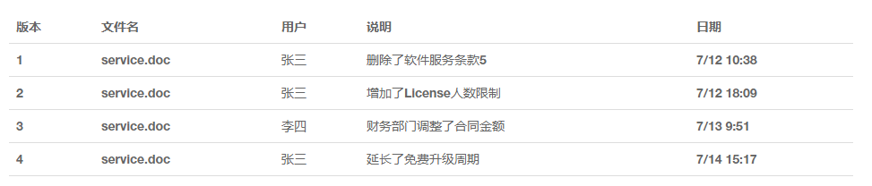

**声明**：本文参考廖雪峰老师的Git教程，删除部分个人不常用功能做为个人的参考笔记，如果有错漏，欢迎联系我，原文地址是<https://www.liaoxuefeng.com/wiki/0013739516305929606dd18361248578c67b8067c8c017b000>

<!-- TOC -->

- [Git简介](#git简介)
- [集中式VS分布式](#集中式vs分布式)
- [安装Git](#安装git)
- [Git命令](#git命令)
  - [创建版本库（仓库repository）](#创建版本库仓库repository)
  - [把文件提交到仓库](#把文件提交到仓库)
  - [工作区和暂存区](#工作区和暂存区)
    - [工作区（Working Directory）](#工作区working-directory)
    - [版本库（Repository）](#版本库repository)
  - [版本回退](#版本回退)
    - [撤销修改](#撤销修改)
    - [删除文件](#删除文件)
- [远程仓库GitHub](#远程仓库github)
  - [关联Git和github](#关联git和github)
  - [添加远程库](#添加远程库)
  - [从远程库克隆](#从远程库克隆)
  - [使用Git上传文件到GitHub](#使用git上传文件到github)
- [分支管理](#分支管理)
  - [为什么需要分支？](#为什么需要分支)
  - [创建和合并分支](#创建和合并分支)
  - [解决冲突](#解决冲突)
  - [Bug分支](#bug分支)
  - [feature分支](#feature分支)
- [标签管理](#标签管理)
  - [创建分支](#创建分支)
  - [操作标签](#操作标签)

<!-- /TOC -->

# Git简介

Git是分布式版本控制系统，能记录每次对文件的改动

# 集中式VS分布式

svn是集中式的版本控制系统，必须联网才能工作，版本库集中存放在中央服务器，首先自己从中央服务器取得最新版本，在本地服务器修改后，再把更改推送给中央服务器。记住每次提交前要先进行更新操作，是否有有版本冲突。

分布式版本控制系统在每个人本地服务器里都有完整的版本库，可以直接把各自的修改推送给对方，但是分布式版本控制系统通常也有一台充当“中央服务器”的电脑，可以方便交换大家的修改。特别是Git有强大的分支管理。

# 安装Git

在Windows上安装Git，直接在Git官网直接[下载安装程序](https://git-scm.com/downloads)然后按默认选项安装即可。
在开始菜单里找到“Git”->“Git Bash”，会弹出一个类似命令行窗口，说明Git安装成功。

安装完成后，需要设置本地服务器的用户名和Email，在命令行输入：

<pre><code>$ git config --global user.name "Your Name"
$ git config --global user.email "email@example.com"
</code></pre>

**注意**：<code>git config</code>命令的<code>--global</code>参数，表示本地服务器上所有的Git仓库都会使用这个配置，当然可以给某个仓库指定不同的用户名和Email

# Git命令

## 创建版本库（仓库repository）

首先创建一个空目录
<pre><code>$ mkdir learngit   //新建目录
$ cd learngit      //进入这个目录
$ pwd              // 显示当前目录
/Users/michael/learngit
</code></pre>
初始化这个目录变成Git可以管理的仓库
<pre><code>$ git init
Initialized empty Git repository in /Users/michael/learngit/.git/    //仓库成功并且告知是一个空的仓库
</code></pre>
当前目录会多一个<code>.git</code>的目录，这个目录是Git用来跟踪管理版本库的，不要手动修改，以免破坏仓库

**注意**：图片、视频这些二进制文件，虽然也能由版本控制系统管理，但没法跟踪文件的变化，只能看总体大小的变化，无法知道具体更改部分，Microsoft的Word格式是二进制格式，版本控制系统是没法跟踪Word文件的改动的，如果要真正使用版本控制系统，就要以纯文本方式编写文件

## 把文件提交到仓库

第一步，把文件添加到仓库
<pre><code>$ git add 文件名
</code></pre>
<pre><code>$ git add .          //把所有的文件都添加仓库
</code></pre>

第二步，把文件提交到仓库
<pre><code>$ git commit -m "本次提交的说明"
</code></pre>
为什么Git添加文件需要add，commit一共两步呢？下面再解释

## 工作区和暂存区

### 工作区（Working Directory）

新建的文件夹learngit就是一个工作区

### 版本库（Repository）

工作区有一个隐藏目录.git，这个不算工作区，而是Git的版本库。
Git的版本库里存了很多东西，其中最重要的就是称为stage（或者叫index）的暂存区，还有Git为我们自动创建的第一个分支master，以及指向master的一个指针叫HEAD。

第一步是用git add把文件添加进去，实际上就是把文件修改添加到暂存区；

第二步是用git commit提交更改，实际上就是把暂存区的所有内容提交到当前分支。

因为我们创建Git版本库时，Git自动为我们创建了唯一一个master分支，所以，现在，git commit就是往master分支上提交更改。

## 版本回退

查看仓库当前的状态，可以确认有没有需要提交的修改
<pre><code>$ git status
</code></pre>
查看修改的内容
<pre><code>$ git diff 文件名
</code></pre>
查看提交的日志，输出版本号，作者，日期和提交信息
<pre><code>$ git log
</code></pre>
git log加上--pretty=oneline参数就只输出版本号和提交的书面
<pre><code>$ git log --pretty=oneline
</code></pre>
把当前版本回退到上一个版本，用HEAD表示当前版本，上一个版本就是HEAD^，上上一个版本就是HEAD^^，可以写成HEAD~100
<pre><code>$ git reset --hard HEAD^
</code></pre>
查看文件内容
<pre><code>$ cat 文件名
</code></pre>
查看回退前的版本，查看回退前的日志找回版本号
<pre><code>$ git reset --hard 版本号
</code></pre>
Git版本回退速度很快，因为Git在内部有个指向当前版本的HEAD指针，当你回退版本的时候，Git仅仅是把HEAD指向更改了。

查看命令的日志，可以找寻到回退前的版本号，从而可以回到回退前的版本
<pre><code>$ git reflog
</code></pre>

### 撤销修改

git checkout -- file可以丢弃工作区的修改：
<pre><code>$ git checkout -- 文件名
</code></pre>

命令git checkout -- readme.txt意思就是，把readme.txt文件在工作区的修改全部撤销，这里有两种情况：

一种是readme.txt自修改后还没有被放到暂存区，现在，撤销修改就回到和版本库一模一样的状态；

一种是readme.txt已经添加到暂存区后，又作了修改，现在，撤销修改就回到添加到暂存区后的状态。

总之，就是让这个文件回到最近一次git commit或git add时的状态。
假设你不但改错了东西，还从暂存区提交到了版本库，可以进行版本回退，不过前提是没有推送到远程库。

### 删除文件

可以直接在文件管理器中把没用的文件删了，或者用rm命令删
<pre><code>$ rm 文件名
</code></pre>
要从版本库中删除该文件，那就用命令git rm删掉，并且git commit：
<pre><code>$ git rm 文件名
rm 文件名
$ git commit -m "删除说明"
</code></pre>

# 远程仓库GitHub

## 关联Git和github

GitHub可以提供Git仓库托管服务，注册一个GitHub账号，就可以免费获得Git远程仓库。由于你的本地Git仓库和GitHub仓库之间的传输是通过SSH加密的，所以需要设置：

**第1步**：创建SSH Key。在用户主目录下，看看有没有.ssh目录，如果有，再看看这个目录下有没有id_rsa和id_rsa.pub这两个文件，如果已经有了，可直接跳到下一步。如果没有，打开Shell（Windows下打开Git Bash），创建SSH Key：
<pre><code>$ ssh-keygen -t rsa -C "你的邮箱地址"
</code></pre>
一路回车，如果一切顺利的话，可以在用户主目录里找到.ssh目录，里面有id_rsa和id_rsa.pub两个文件，这两个就是SSH Key的秘钥对，id_rsa是私钥，不能泄露出去，id_rsa.pub是公钥，可以放心地告诉任何人。

**第2步**：登陆GitHub，打开“Account settings”，“SSH Keys”页面：

然后，点“Add SSH Key”，填上任意Title，在Key文本框里粘贴id_rsa.pub文件的内容：

点“Add Key”，你就应该看到已经添加的Key：

为什么GitHub需要SSH Key呢？因为GitHub需要识别出你推送的提交确实是你推送的，而不是别人冒充的，而Git支持SSH协议，所以，GitHub只要知道了你的公钥，就可以确认只有你自己才能推送。

GitHub允许你添加多个Key。假定你有若干电脑，你一会儿在公司提交，一会儿在家里提交，只要把每台电脑的Key都添加到GitHub，就可以在每台电脑上往GitHub推送了。

## 添加远程库

登陆GitHub，然后，在右上角找到“Create a new repo”按钮，创建一个新的仓库：

在Repository name填入learngit，其他保持默认设置，点击“Create repository”按钮，就成功地创建了一个新的Git仓库：

目前，在GitHub上的这个learngit仓库还是空的，GitHub告诉我们，可以从这个仓库克隆出新的仓库，也可以把一个已有的本地仓库与之关联，然后，把本地仓库的内容推送到GitHub仓库。

现在，我们根据GitHub的提示，在本地的learngit仓库下运行命令：
<pre><code>$ git remote add origin git@github.com:Github账户名/learngit.git
</code></pre>
添加后，远程库的名字就是origin，这是Git默认的叫法。

下一步，就可以把本地库的所有内容推送到远程库上：
<pre><code>$ git push -u origin master
</code></pre>
实际上是把当前分支master推送到远程。

由于远程库是空的，我们第一次推送master分支时，加上了-u参数，Git不但会把本地的master分支内容推送的远程新的master分支，还会把本地的master分支和远程的master分支关联起来，在以后的推送或者拉取时就可以简化命令。

推送成功后，可以立刻在GitHub页面中看到远程库的内容已经和本地一模一样，从现在起，只要本地作了提交，就可以通过命令：
<pre><code>$ git push origin master
</code></pre>
把本地master分支的最新修改推送至GitHub，现在，你就拥有了真正的分布式版本库！

## 从远程库克隆

假设我们从零开发，那么最好的方式是先创建远程库，然后，从远程库克隆。

首先，登陆GitHub，创建一个新的仓库，名字叫gitskills：

我们勾选Initialize this repository with a README，这样GitHub会自动为我们创建一个README.md文件。创建完毕后，可以看到README.md文件：

现在，远程库已经准备好了，下一步是用命令git clone克隆一个本地库
<pre><code> git clone git@github.com:你的GitHub账号/gitskills.git
</code></pre>
GitHub给出的地址不止一个，还可以用https://github.com/michaelliao/gitskills.git这样的地址。实际上，Git支持多种协议，默认的git://使用ssh，但也可以使用https等其他协议。

使用https除了速度慢以外，还有个最大的麻烦是每次推送都必须输入口令，但是在某些只开放http端口的公司内部就无法使用ssh协议而只能用https。

## 使用Git上传文件到GitHub

在需要上传文件的文件夹右键->Git Bash Here打开命令行窗口
在提交代码之前，首先应该检查目前所做的修改
<pre><code>$ git status
</code></pre>
检查没有无误后
<pre><code>$ git add .         //.代表当前目录下的所有文件都加入暂存区
$ git commit -m "本次提交的说明"  //每次提交都应该写清楚说明
$ git pull origin master         //将服务器代码同步到本地
$ git push -u origin master
//接着根据提示输入GitHub的用户名和密码
</code></pre>
推送成功后，可以立刻在GitHub页面中看到远程库的内容已经和本地一模一样。

如果执行失败，一般是没有将服务器代码同步到本地导致的，先执行上面的git pull命令

# 分支管理

## 为什么需要分支？

创建一个属于你自己的分支，别人看不到，还继续在原来的分支上正常工作，而你在自己的分支上干活，想提交就提交，直到开发完毕后，再一次性合并到原来的分支上，这样，既安全，又不影响别人工作。

## 创建和合并分支

首先，我们创建dev分支，然后切换到dev分支：
<pre><code>$ git checkout -b dev
Switched to a new branch 'dev'
</code></pre>
git checkout命令加上-b参数表示创建并切换，相当于以下两条命令：
<pre><code>$ git branch dev
$ git checkout dev
Switched to branch 'dev'
</code></pre>
然后，用git branch命令查看当前分支：
<pre><code>$ git branch
* dev
  master
</code></pre>
git branch命令会列出所有分支，当前分支前面会标一个*号。
然后，我们就可以在dev分支上正常提交
<pre><code>$ git add readme.txt
$ git commit -m "branch test"
[dev fec145a] branch test
 1 file changed, 1 insertion(+)
</code></pre>
现在，dev分支的工作完成，我们就可以切换回master分支：
<pre><code>$ git checkout master
Switched to branch 'master'
</code></pre>
切换回master分支后，刚才提交的内容不见了！因为那个提交是在dev分支上，而master分支此刻的提交点并没有变：

现在，我们把dev分支的工作成果合并到master分支上：
<pre><code>$ git merge dev
Updating d17efd8..fec145a
Fast-forward
 readme.txt |    1 +
 1 file changed, 1 insertion(+)
</code></pre>
合并完成后，就可以放心地删除dev分支了：
<pre><code>$ git branch -d dev
Deleted branch dev (was fec145a).
</code></pre>
删除后，查看branch，就只剩下master分支了：
<pre><code>$ git branch
* master
</code></pre>
因为创建、合并和删除分支非常快，所以Git鼓励你使用分支完成某个任务，合并后再删掉分支，这和直接在master分支上工作效果是一样的，但过程更安全。

## 解决冲突

如果master分支和dev分支各自都分别有新的提交，就会出现冲突：

这种情况下，Git无法执行“快速合并”，只能试图把各自的修改合并起来，但这种合并就可能会有冲突：

<pre><code>$ git merge feature1
</code></pre>
git status告诉我们冲突的文件：

<pre><code>$ git status
</code></pre>
可以直接查看冲突的内容，Git用<<<<<<<，=======，>>>>>>>标记出不同分支的内容，我们修改后保存
再提交：
<pre><code>$ git add readme.txt
$ git commit -m "conflict fixed"
</code></pre>
现在，master分支和feature1分支变成了下图所示：

用带参数的git log也可以看到分支的合并情况：
<pre><code>$ git log --graph --pretty=oneline --abbrev-commit
</code></pre>
最后，删除feature1分支：
<pre><code>$ git branch -d feature1
</code></pre>
当Git无法自动合并分支时，就必须首先解决冲突。解决冲突后，再提交，合并完成。

**注意**：合并分支时，加上--no-ff参数就可以用普通模式合并，合并后的历史有分支，能看出来曾经做过合并，而fast forward合并就看不出来曾经做过合并。

## Bug分支

当手头工作没有完成时，先把工作现场git stash一下，然后去新建分支去修复bug，修复后，切换到master分支在完成合并，最后删除Bug分支，在切换回到dev分支，一是用git stash apply恢复，但是恢复后，stash内容并不删除，你需要用git stash drop来删除；
另一种方式是用git stash pop，恢复的同时把stash内容也删了，回到工作现场。

## feature分支

开发一个新feature，最好新建一个分支；
如果要丢弃一个没有被合并过的分支，可以通过git branch -D <name>强行删除。

# 标签管理

发布一个版本时，我们通常先在版本库中打一个标签（tag），这样，就唯一确定了打标签时刻的版本。将来无论什么时候，取某个标签的版本，就是把那个打标签的时刻的历史版本取出来。所以，标签也是版本库的一个快照。
Git的标签虽然是版本库的快照，但其实它就是指向某个commit的指针（跟分支很像对不对？但是分支可以移动，标签不能移动），所以，创建和删除标签都是瞬间完成的。

Git有commit，为什么还要引入tag？

**因为版本号不好记~**

## 创建分支

在Git中打标签非常简单，首先，切换到需要打标签的分支上：

<pre><code>$ git branch
* dev
  master
$ git checkout master
Switched to branch 'master'
</code></pre>
然后，敲命令git tag <name>就可以打一个新标签：
<pre><code>$ git tag v1.0
</code></pre>
可以用命令git tag查看所有标签：
<pre><code>$ git tag
v1.0
</code></pre>
默认标签是打在最新提交的commit上的。有时候，如果忘了打标签，比如，现在已经是周五了，但应该在周一打的标签没有打，怎么办？

方法是找到历史提交的commit id，然后打上就可以了：
<pre><code>$ git log --pretty=oneline --abbrev-commit
6a5819e merged bug fix 101
cc17032 fix bug 101
7825a50 merge with no-ff
6224937 add merge
59bc1cb conflict fixed
400b400 & simple
75a857c AND simple
fec145a branch test
d17efd8 remove test.txt
</code></pre>
比方说要对add merge这次提交打标签，它对应的commit id是6224937，敲入命令：
<pre><code>$ git tag v0.9 6224937
</code></pre>
再用命令git tag查看标签：
<pre><code>$ git tag
v0.9
v1.0
</code></pre>
注意，标签不是按时间顺序列出，而是按字母排序的。可以用git show <tagname>查看标签信息

还可以创建带有说明的标签，用-a指定标签名，-m指定说明文字：
<pre><code>$ git tag -a v0.1 -m "version 0.1 released" 3628164
</code></pre>

## 操作标签

如果标签打错了，也可以删除：
<pre><code>$ git tag -d v0.1
</code></pre>
因为创建的标签都只存储在本地，不会自动推送到远程。所以，打错的标签可以在本地安全删除。

如果要推送某个标签到远程，使用命令git push origin <tagname>：
<pre><code>$ git push origin v1.0
</code></pre>
或者，一次性推送全部尚未推送到远程的本地标签：
<pre><code>$ git push origin --tags
</code></pre>
可以删除一个远程标签
<pre><code>$ git push origin :refs/tags/tagname
</code></pre>