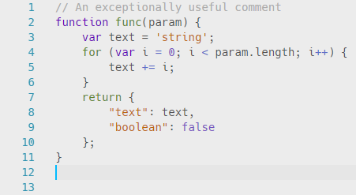
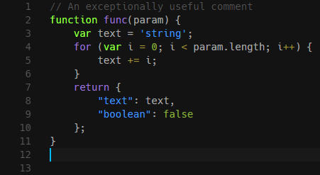
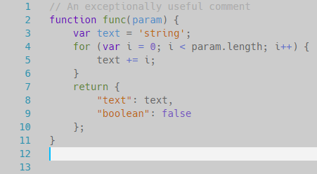
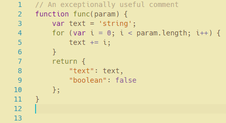
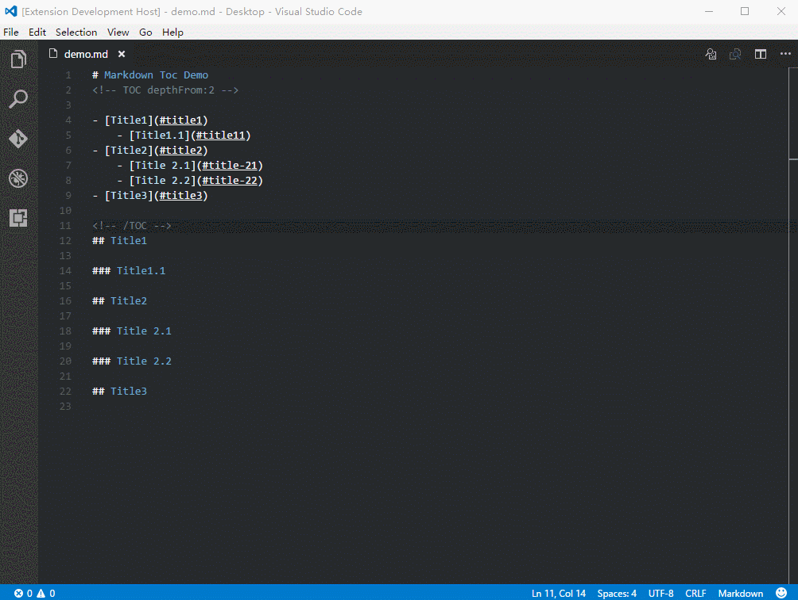
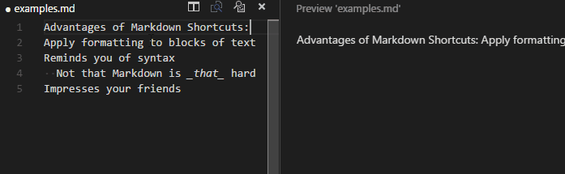
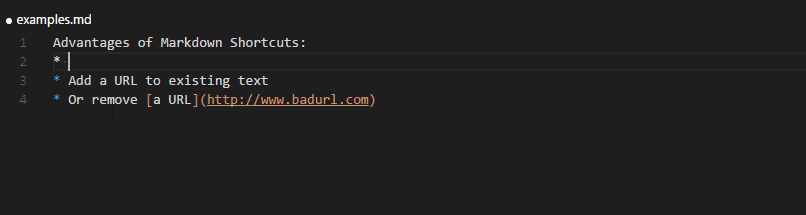
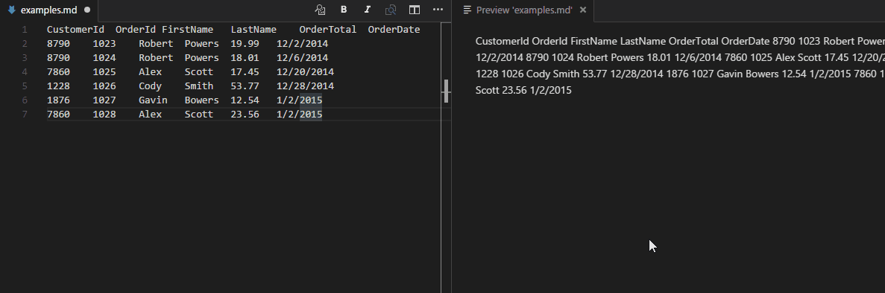
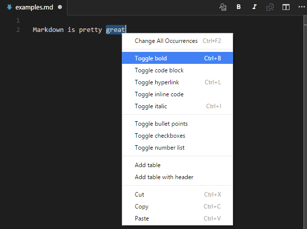
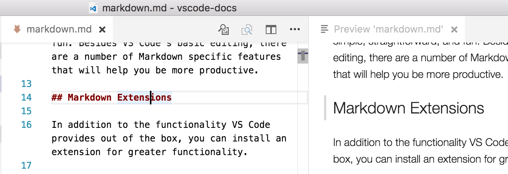

**声明**：原文链接为<https://code.visualstudio.com/docs/languages/markdown>
简化了内容，保留了常用的功能
<!-- TOC -->

- [Markdown and VS Code](#markdown-and-vs-code)
  - [Markdown扩展](#markdown扩展)
    - [[markdownlint](https://marketplace.visualstudio.com/items?itemName=DavidAnson.vscode-markdownlint)](#markdownlinthttpsmarketplacevisualstudiocomitemsitemnamedavidansonvscode-markdownlint)
    - [[Markdown Theme Kit](https://marketplace.visualstudio.com/items?itemName=ms-vscode.Theme-MarkdownKit)](#markdown-theme-kithttpsmarketplacevisualstudiocomitemsitemnamems-vscodetheme-markdownkit)
      - [Markdown Editor](#markdown-editor)
      - [Markdown Editor Dark](#markdown-editor-dark)
      - [Markdown Editor Focus](#markdown-editor-focus)
      - [Markdown Editor Yellow](#markdown-editor-yellow)
    - [[Markdown TOC](https://marketplace.visualstudio.com/items?itemName=AlanWalk.markdown-toc)](#markdown-tochttpsmarketplacevisualstudiocomitemsitemnamealanwalkmarkdown-toc)
    - [[Markdown Shortcuts](https://marketplace.visualstudio.com/items?itemName=mdickin.markdown-shortcuts)](#markdown-shortcutshttpsmarketplacevisualstudiocomitemsitemnamemdickinmarkdown-shortcuts)
      - [快速切换项目符号点](#快速切换项目符号点)
      - [轻松生成网址](#轻松生成网址)
      - [将表格数据转换成表格](#将表格数据转换成表格)
      - [上下文和标题菜单集成](#上下文和标题菜单集成)
  - [Markdown预览](#markdown预览)
  - [编辑器和预览同步](#编辑器和预览同步)

<!-- /TOC -->
# Markdown and VS Code

在Visual Studio code使用Markdown文件很简单。除了VS Code的基本编辑外，还有许多Markdown特定功能可以帮助您提高工作效率。

## Markdown扩展

除了VS code提供的功能外，您还可以安装扩展程序以获得更好的功能。

### [markdownlint](https://marketplace.visualstudio.com/items?itemName=DavidAnson.vscode-markdownlint)

它包含一个鼓励标准和Markdown文件一致性的规则库

### [Markdown Theme Kit](https://marketplace.visualstudio.com/items?itemName=ms-vscode.Theme-MarkdownKit)

基于SublimeText-Markdown / MarkdownEditing的一组主题。

#### Markdown Editor

#### Markdown Editor Dark

#### Markdown Editor Focus

#### Markdown Editor Yellow

### [Markdown TOC](https://marketplace.visualstudio.com/items?itemName=AlanWalk.markdown-toc)

从解析的Markdown文件生成标题的TOC（目录）

### [Markdown Shortcuts](https://marketplace.visualstudio.com/items?itemName=mdickin.markdown-shortcuts)

提供自动编辑Markdown（.md，.markdown）文件的快捷键。

#### 快速切换项目符号点

#### 轻松生成网址

#### 将表格数据转换成表格

#### 上下文和标题菜单集成

提示：点击上面的链接可阅读说明和评论

## Markdown预览

VS Code支持Markdown文件，使用.md扩展名保存该文件，就可以编写Markdown文本，您可以在编辑器内切换代码和Markdown文件的预览

* 要在视图之间切换，请在编辑器中按Ctrl + Shift + V
* 使用正在编辑的文件并排查看预览按(Ctrl+K V)，在编辑时可以实时查看更改

## 编辑器和预览同步

* 在编辑器侧面使用Markdown预览时，VS Code可以同步编辑器视图和预览。默认情况下，Markdown预览会自动滚动以显示编辑器中选定行的元素

* 当前选定的行在Markdown预览中通过左侧空白处的浅灰色条显示：

* 双击Markdown预览中的元素将自动打开该文件的编辑器并滚动到最接近单击元素的行
