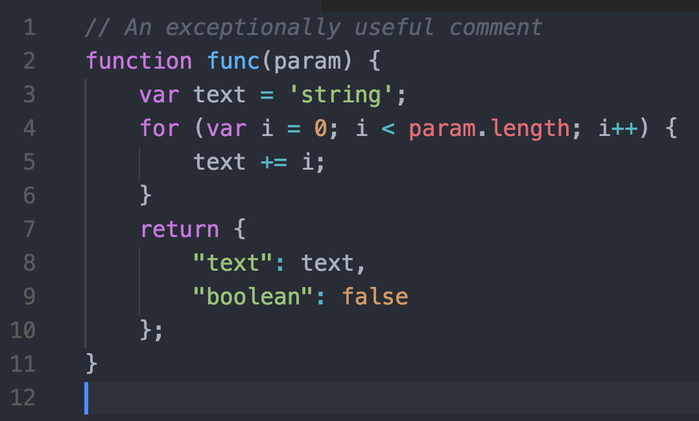

<!-- TOC -->

- [前端必装插件](#前端必装插件)
  - [Auto Close Tag](#auto-close-tag)
  - [Auto Rename Tag](#auto-rename-tag)
  - [Beautify](#beautify)
  - [Atom One Dark Theme](#atom-one-dark-theme)
  - [Code Runner](#code-runner)
  - [colorize](#colorize)
  - [Debugger for Chrome](#debugger-for-chrome)
  - [Document This](#document-this)
  - [EditorConfig for VS Code](#editorconfig-for-vs-code)
  - [ESLint](#eslint)
  - [Git History](#git-history)
  - [HTML CSS Support](#html-css-support)
  - [HTML Snippets](#html-snippets)
  - [IIS Express](#iis-express)
  - [IIS Express executer](#iis-express-executer)
  - [IntelliSense for CSS class names in HTML](#intellisense-for-css-class-names-in-html)
  - [JavaScript (ES6) code snippets](#javascript-es6-code-snippets)
  - [jQuery Code Snippets](#jquery-code-snippets)
  - [jslint](#jslint)
  - [Live server](#live-server)
  - [Material Icon Theme](#material-icon-theme)
  - [npm](#npm)
  - [npm Intellisense](#npm-intellisense)
  - [Output Colorizer](#output-colorizer)
  - [Path Autocomplete](#path-autocomplete)
  - [Path Intellisense](#path-intellisense)
  - [SCSS IntelliSense](#scss-intellisense)
  - [stylelint](#stylelint)
  - [Trailing Spaces](#trailing-spaces)
  - [Version Lens](#version-lens)
  - [Vetur](#vetur)
  - [View In Browser](#view-in-browser)
  - [Visual Studio Keymap](#visual-studio-keymap)
  - [vscode-element-helper](#vscode-element-helper)
  - [vscode-icons](#vscode-icons)

<!-- /TOC -->


# 前端必装插件

## Auto Close Tag

自动添加HTML / XML关闭标签

**注意**：此扩展可用于XML，PHP，Vue，JavaScript，TypeScript，JSX，TSX等其他语言。它是可配置的。

特点

* 当您键入开始标记的右括号时，自动添加结束标记
* 插入结束标记后，光标位于开始和结束标记之间
* 设置不会自动关闭的标签列表
* 自动关闭自闭标签
* 支持自动关闭标签为Sublime Text 3
* 使用键盘快捷键或命令选项板手动添加关闭标签

## Auto Rename Tag

自动重新命名配对的HTML / XML标签

特点

* 当您重命名一个HTML / XML标记时，会自动重命名配对的HTML / XML标记


## Beautify

格式化javascript，JSON，CSS，Sass，和HTML在Visual Studio代码

## Atom One Dark Theme

基于Atom的One Dark主题的VSCode 主题。市场上最受好评的One Dark主题端口，具有完整的Workbench主题。




## Code Runner

运行多种语言的代码片段或代码文件

特点

* 运行当前活动文本编辑器的代码文件
* 通过文件浏览器的上下文菜单运行代码文件
* 在文本编辑器中运行选定的代码片段
* 每个Shebang运行代码
* 运行自定义命令
* 停止代码运行
* 在输出窗口中查看输出
* 设置默认语言运行
* 选择要运行的语言
* 通过在集成终端中运行代码来支持REPL

## colorize

立即可视化css / sass / less / postcss / stylus / XML ...文件中的css颜色。

这个扩展可以让你的样式文件寻找颜色并为它们中的每一个生成一个彩色背景（使用颜色）。


特点：

* 为css变量生成彩色背景
* 为预处理器变量生成彩色背景
* 为hsl颜色生成彩色背景
* 为hsla颜色生成彩色背景
* 为跨浏览器颜色生成彩色背景
* 为css六色生成彩色背景
* 为rgb颜色生成彩色背景
* 为rgba颜色生成彩色背景
* 更新颜色时更新背景

## Debugger for Chrome

一个VS代码扩展，用于在Google Chrome浏览器或其他支持Chrome DevTools协议的目标中调试JavaScript代码。


支持的功能

* 设置断点，包括启用源映射时在源文件中
* 步进，包括Chrome页面上的按钮
* 当地人窗格
* 调试eval脚本，脚本标记和动态添加的脚本
* 监控
* 控制台

不支持的方案

调试web工作者
任何不是脚本调试的功能。

**个人认为调试js直接使用Google开发者工具会更加方便！**


## Document This

可为TypeScript和JavaScript文件自动生成详细的JSDoc注释


支持JSDoc和Closure编译器标签：@class，@description，@enum，@export，@function，@implements，@interface，@ param，@ private，@returns，@static，@template，@type和@memberOf。

Ctrl+Alt+D 然后再次 Ctrl+Alt+D

## EditorConfig for VS Code 

该插件尝试用.editorconfig文件中的设置覆盖用户/工作区设置。不需要额外的或特定于vscode的文件。正如任何EditorConfig插件，如果root=true没有指定，EditorConfig 将继续寻找一个.editorconfig文件的项目之外。

团队开发中最好保持 IDE 的统一，现实中却因为团队成员所熟悉的编辑器或者 IDE 肯定不是一样的，因此我们也不好也没必要限制大家使用统一的 IDE。EditorConfig用来解决由于使用不同的编辑器或者 IDE 可能导致的代码风格不一致问题，通过在工程中增加一个配置文件以及安装对应的插件，实现在不同编辑器和 IDE 保持工程中代码文件编码格式的一致性

## ESLint

将ESLint集成到VS代码中

该扩展使用安装在打开的工作区文件夹中的ESLint库。如果该文件夹没有提供一个扩展程序查找全局安装版本。如果您尚未在本地或全局安装ESLint，请npm install eslint在工作区文件夹中运行以进行本地安装或npm install -g eslint全局安装。

设置选项

eslint.enable：启用/禁用eslint。默认情况下启用。

## Git History

* 查看和搜索git日志以及图表和细节。
* 查看文件的前一个副本。
* 查看和搜索历史
    * 查看一个或所有分支的历史（git log）
    * 查看文件的历史记录
    * 查看文件中一行的历史记录（Git Blame）。
    * 查看作者的历史
* 比较：
    * 比较分支
    * 比较提交
    * 通过提交比较文件
* 其他功能：
    * Github的头像
    * 挑选提交
    * 恢复提交
    * 从提交创建分支
    * 查看树视图中的提交信息（所有更改的快照）

打开文件查看历史记录，然后按F1并选择/键入“Git：View History”，“Git：View File History”或“Git：View Line History”。

命令：

* 查看Git历史记录（git log）（git.viewHistory）
* 查看文件历史记录（git.viewFileHistory）
* 查看线路历史记录（git.viewLineHistory）


## HTML CSS Support

* 让HTML标签上智能提示当前项目所支持的样式
* 类属性补全。
* Id属性补全成。

支持语言：

* html
* laravel-blade
* razor
* vue
* pug
* jade
* handlebars
* php
* twig
* md
* nunjucks
* javascript
* javascriptreact

## HTML Snippets

禁用此扩展程序，因为它当前存在冲突，与代码HTML扩展冲突

* 完整的HTML5标签
* 彩色化
* 片段
* [部分实施]快速信息
* 描述中提到了标签是否被弃用

## IIS Express

此扩展使您能够运行在Visual Studio代码中打开的文件夹作为使用IIS Express的网站。

命令：

* Start Website - 启动当前文件夹作为网站运行
* Stop Website - 停止当前文件夹作为网站运行
* Restart Website - 重新启动（停止并启动）作为网站运行的当前文件夹

特点：

* 自动在浏览器打开文件夹
* 超级简单的方式从命令板上启动和停止网站
* 直接在Visual Studio中查看从IIS Express命令行输出
* 通过ApplicationHost.configIIS Express运行的所有站点的通用更改支持PHP

## IIS Express executer

有了这个扩展，你可以直接使用Visual Studio code在IIS中运行你的网站

特点：

* 检查您的环境是否兼容
* 为iis安装设置一个自定义路径
* 为iis执行设置自定义路径（您也可以直接从工作区和鼠标上下文菜单中设置它）
* 从鼠标右键菜单直接在文件夹中执行服务器
* 如果需要，重置默认设置
* 选择您想要打开的浏览器（MSEdge，Opera，Firefox，Chrome）
* 设置端口

## IntelliSense for CSS class names in HTML

Visual Studio代码扩展，它class基于工作空间中找到的定义或通过link元素引用的外部文件为HTML 属性提供CSS类名称补全


特点：

* 为工作区中的CSS类定义提供自动完成功能（在CSS文件中定义或在“支持的语言模式”部分中列出的文件类型中）
* 支持通过linkHTML文件中的元素引用的外部样式表
* 用于手动重新缓存自动完成中使用的类定义的命令
* 用户设置来覆盖哪些文件夹和文件应该被考虑或从缓存过程中排除

## JavaScript (ES6) code snippets

此扩展包含用于Vscode编辑器（支持JavaScript和TypeScript）的ES6语法中用于JavaScript的代码片段。

支持的语言（文件扩展名）

* JavaScript（.js）
* TypeScript（.ts）
* JavaScript React（.jsx）
* TypeScript React（.tsx）
* Html（.html）
* Vue（.vue）

## jQuery Code Snippets

超过130个用于JavaScript代码的jQuery代码片段。

只需键入字母'jq'即可获得所有可用jQuery代码片段的列表。


## jslint

将JSLint集成到VS代码中。

为了禁用工作区的JSLint，请"jslint.enable": false在工作区设置中指定。JSLint默认启用。

## Live server

为静态和动态页面启动具有实时重新加载功能的开发本地服务器。


Live Server现在支持PHP等动态页面。

为静态和动态页面启动具有实时重新加载功能的开发本地服务器。

实时服务器演示VSCode

启动/停止服务器的快捷方式

1.打开一个项目并直接点击Go Live从StatusBar打开/关闭服务器。


2.右键单击HTML资源管理器窗口中的文件并单击Open with Live Server。


3.打开一个HTML文件并右键点击编辑器并选择选项。


特点

* 带有实时浏览器重新加载的快速开发Live Server。
* 从状态栏单击一次即可启动或关闭服务器。
* 从资源管理器菜单中打开一个HTML文件浏览器[ Quick Gif Demo ]。
* 支持排除更改检测的文件。
* 热键控制。
* 可定制的端口号，服务器根，默认浏览器。
* 使用高级命令行支持任何浏览器（例如：Firefox Nightly）。
* 支持Chrome调试附件（更多信息）。[ 快速Gif演示 ]。
* 通过WLAN进行远程连接（例如：连接到手机）[需要帮助吗？请参阅FAQ部分]
* 使用更合适的主机名称（localhost或127.0.0.1）。
* 可定制的Live Reload功能支持标签。（默认是Body或head）
* SVG支持
* https 支持。
* 支持代理。
* CROS启用
* 通过Live Server Web Extension支持任何文件甚至动态页面。

## Material Icon Theme

Material Icon Theme提供了许多基于Visual Studio代码的材质设计的图标。

文件图标


文件夹图标


## npm

管理npm命令的VSCode扩展

命令：
* npm init
* npm install
* npm install * --save
* npm install * --save-dev
* npm uninstall * --save
* npm uninstall * --save-dev
* npm start
* npm test
* npm publish [tag]
* npm deprecate *[@version] message （实验）
* npm run 脚本

## npm Intellisense

在导入语句中自动完成npm模块的Visual Studio代码插件


导入命令


导入命令（ES5）


## Output Colorizer

VSCode / Bluemix代码的语言扩展，为输出/调试/扩展面板和*.log文件添加语法着色。

## Path Autocomplete

为Visual Studio代码提供路径补全。


## Path Intellisense

自动补全文件名


## SCSS IntelliSense

* 代码完成建议（变量，混合函数，函数） - 描述
* 悬停（变量，混合，功能） - 描述
* 签名帮助（mixins，functions） - 描述
* 代码导航
  * go to（变量，mixins，函数） - 描述
  * 显示文件夹中的所有符号定义（变量，混合，功能） - 描述
* Visual Studio参考注释：// 。
* @import "filepath";从任何地方导入文件。即使在公开的工作空间之外。

## stylelint

检查样式错误，强烈建议使用

支持：

* CSS (css)
* HTML (html)
* Less (less)
* Markdown (markdown)
* Markdown+MathML (source.markdown.math)
* PostCSS (postcss)
* Sass (sass)
* SCSS (scss)
* Sugarss (sugarss)
* Vue (vue)
* Vue-HTML (vue-html)
* XML (xml)

## Trailing Spaces

突出显示尾部空格并在闪存中将其删除！

## Version Lens

在Visual Studio code编辑器中显示npm，jspm，bower，dub和dotnet核心的包版本信息。


## Vetur

VS编码的Vue工具，由vue-language-server提供支持。

特点

* 语法加亮
* 片段
* Emmet
* Linting /错误检查
* 格式化
* 自动完成
* 调试

## View In Browser

在浏览器中查看html文件

## Visual Studio Keymap

这个扩展将流行Visual Studio键盘快捷键到Visual Studio code。安装扩展并重新启动VS Code之后，您现在可以使用Visual Studio中最喜欢的键盘快捷键。

## vscode-element-helper

为帮助开发人员通过Element-UI编写更高效的应用程序而诞生

用法

1 - 将光标移动到Element-UI标签或将其选中

2 - 按下默认热键ctrl + cmd + z（windows ctrl + win + z：）或按⇧⌘P弹出命令选项板，然后输入element-helper.search

3 - 显示文档视图如果完全匹配，或者您应该选择要搜索的标签

4 - 进入并触发文件浏览器


版本，行情，缩进大小和语言切换

1 - 输入Preferences- > setting或快捷键cmd+,

2 - 修改语言，版本或缩进大小

```
  "element-helper.language": "zh-CN",
  "element-helper.version": "1.3",
  "element-helper.indent-size": 2,
  "element-helper.quotes": "double",    // html vue qoutes
  "element-helper.pug-quotes": "single" // jade/pug quotes
```
自动补全


代码片段


## vscode-icons

将图标集成到你的编辑器目录下


